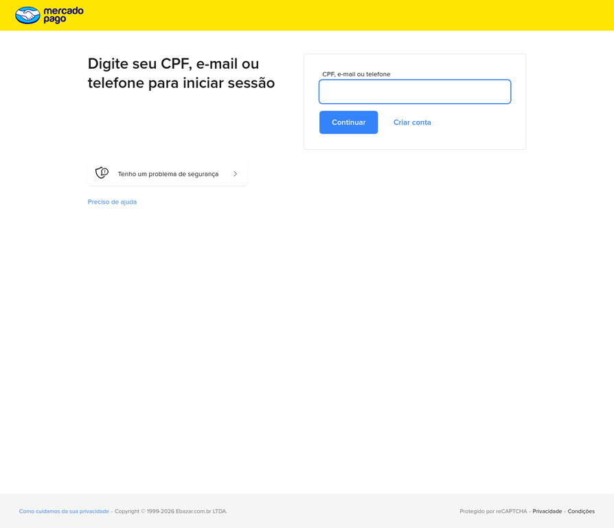
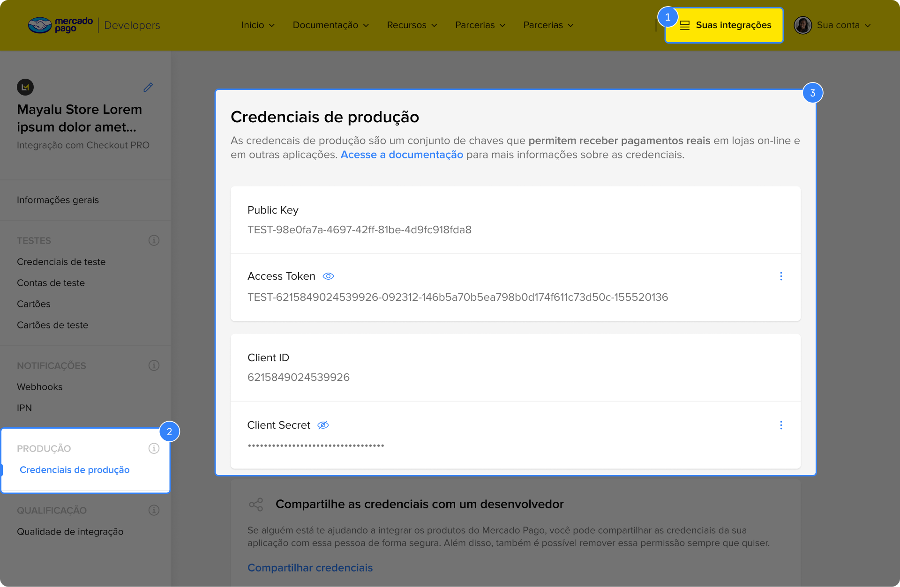
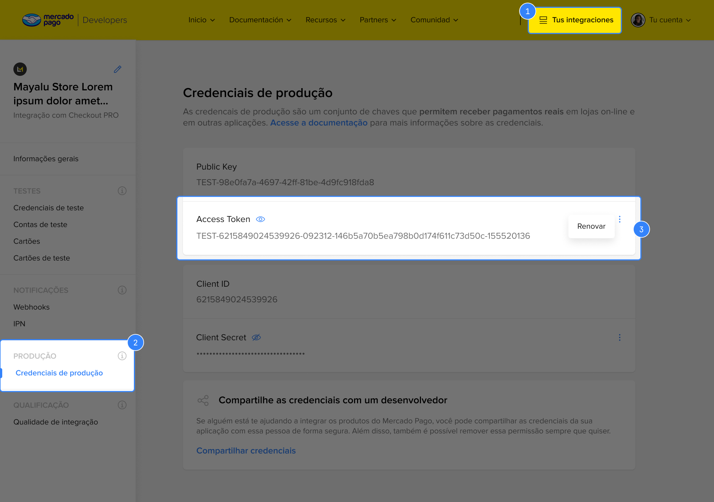

# Como Obter as Credenciais do Mercado Pago para o Barber Pro

Para ativar os pagamentos no Barber Pro, você precisa de duas chaves do Mercado Pago: o **Access Token** (chave privada do servidor) e a **Public Key** (chave pública). Este tutorial mostra exatamente onde encontrá-las.

---

## Passo 1 — Acesse o Portal de Desenvolvedores

Abra o navegador e acesse:

> **[https://www.mercadopago.com.br/developers](https://www.mercadopago.com.br/developers)**

Clique em **"Entrar"** no canto superior direito e faça login com o e-mail e senha da conta Mercado Pago da sua barbearia.



> **Importante:** use a conta que vai **receber os pagamentos** — normalmente a conta PJ ou pessoal da barbearia, não a do cliente.

---

## Passo 2 — Acesse "Suas Integrações"

Após fazer login, clique no botão **"Suas integrações"** no menu superior (destacado em amarelo).



Se ainda não tiver nenhuma integração criada, o sistema pedirá para você criar uma. Dê qualquer nome (ex: "Barber Pro") e selecione **"Checkout Pro"** como tipo de integração.

---

## Passo 3 — Navegue até "Credenciais de produção"

No menu lateral esquerdo, localize a seção **PRODUÇÃO** e clique em **"Credenciais de produção"**.

Você verá uma tela com quatro campos:

| Campo | O que é | Você precisa? |
|---|---|---|
| **Public Key** | Chave pública (começa com `APP_USR-`) | ✅ Sim |
| **Access Token** | Chave privada (começa com `APP_USR-`) | ✅ Sim |
| Client ID | Identificador da aplicação | Não |
| Client Secret | Segredo OAuth | Não |

---

## Passo 4 — Copie a Public Key

A **Public Key** já aparece visível na tela. Clique sobre o valor para selecioná-lo e copie com `Ctrl+C` (ou `Cmd+C` no Mac).

O valor tem este formato:
```
APP_USR-xxxxxxxx-xxxx-xxxx-xxxx-xxxxxxxxxxxx
```

---

## Passo 5 — Revele e Copie o Access Token

O **Access Token** aparece oculto por padrão. Para revelá-lo, clique no **ícone de olho** (👁) ao lado do campo "Access Token".



Após revelar, clique sobre o valor para selecioná-lo e copie com `Ctrl+C`.

O valor tem este formato:
```
APP_USR-0000000000000000-000000-xxxxxxxxxxxxxxxxxxxxxxxxxxxxxxxx-000000000
```

> **Atenção:** o Access Token é uma chave **secreta**. Nunca compartilhe em chats públicos, repositórios GitHub ou redes sociais.

---

## Passo 6 — Cole as Credenciais no Barber Pro

De volta ao Barber Pro, o Manus vai exibir dois campos para você preencher:

- **MP_ACCESS_TOKEN** → cole o valor do Access Token copiado no Passo 5
- **MP_PUBLIC_KEY** → cole o valor da Public Key copiado no Passo 4

Após preencher os dois campos e confirmar, o Manus finalizará a integração automaticamente.

---

## Credenciais de Teste (Opcional)

Se quiser testar os pagamentos sem usar dinheiro real antes de publicar o app, o Mercado Pago oferece credenciais de sandbox. No menu lateral, clique em **"Credenciais de teste"** (na seção TESTES) e copie os valores de lá. As credenciais de teste começam com `TEST-` em vez de `APP_USR-`.

Para testar pagamentos com cartão, use os [cartões de teste oficiais do Mercado Pago](https://www.mercadopago.com.br/developers/pt/docs/your-integrations/test/cards).

---

## Resumo

| Etapa | Ação |
|---|---|
| 1 | Acesse [mercadopago.com.br/developers](https://www.mercadopago.com.br/developers) e faça login |
| 2 | Clique em **Suas integrações** |
| 3 | No menu lateral, clique em **Credenciais de produção** |
| 4 | Copie a **Public Key** |
| 5 | Clique no olho para revelar e copie o **Access Token** |
| 6 | Cole os dois valores nos campos do Barber Pro |
